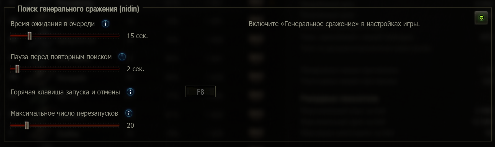

# Поиск генерального сражения

`nidin.auto_queue_retry` — мод для «Мира танков», который помогает искать «Генеральное сражение», повторяя короткие попытки входа в очередь случайных боёв. Тип боя определяет сервер, поэтому попадание в ГС не гарантируется.

[Скачать мод](https://github.com/xNIDINx/auto-queue-retry/releases/latest) · [Исходный код](src/res/scripts/client/gui/mods/mod_auto_queue_retry.py)

Закройте игру и положите файл `.mtmod` без распаковки в `<папка игры>/mods/<версия клиента>/`, оставив только одну версию мода — старый пакет перенесите за пределы этой папки.

## Использование

Включите галочку «Генеральное сражение» в настройках игры, выберите подходящий танк и режим одиночного случайного боя. Нажмите **F8**, чтобы запустить поиск; повторное нажатие остановит цикл и отменит очередь.

По умолчанию мод отменяет поиск примерно на **15-й секунде** ожидания и через **2 секунды** после выхода начинает его заново. После **20 перезапусков** он остаётся в очереди до нахождения боя. При нахождении любого боя цикл завершается; следующий запуск — вручную.

Время ожидания, пауза, горячая клавиша и лимит перезапусков меняются в ангаре через [ModsSettingsAPI](https://github.com/izeberg/modssettingsapi). Для меню также нужен [ModsListAPI](https://gitlab.com/poliroid/modslistapi). Откройте **Модификации → Настройки модификаций → Поиск генерального сражения (nidin)**.

